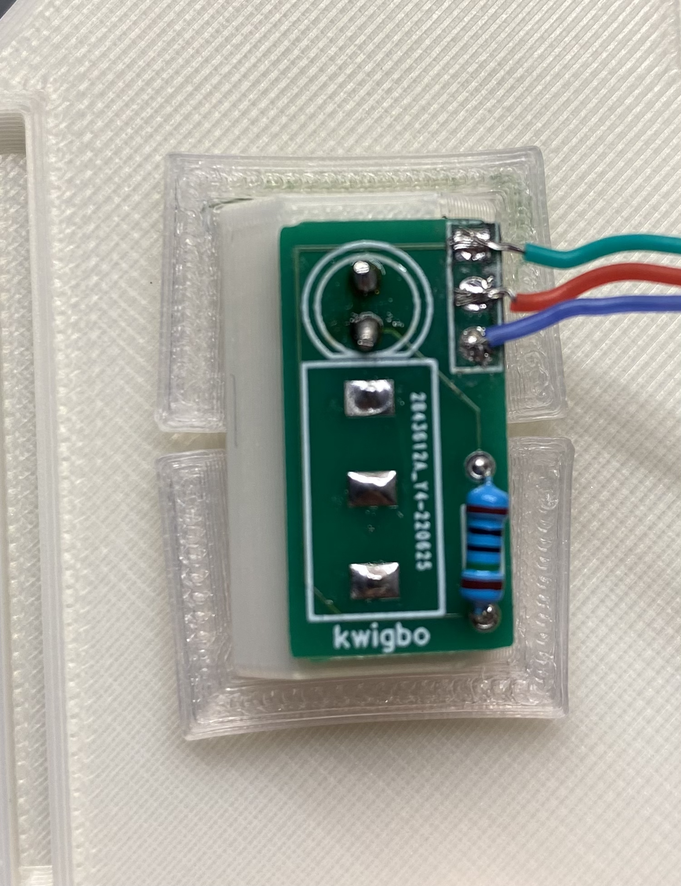

# STEP 13 - Woozle Gameboy Switch

**[< -- Go Back](../README.md)**

**You will need one switch and one LED along with the PCB and printed parts to complete the switch.**

* **Switch Board -> [Gerber](../Woozle%20Switch%20Gerber)**
* **Switches -> [Amazon](https://a.co/d/1mCzNco)**
* **LEDs -> [Amazon](https://a.co/d/bPgX2ja)**

## Files

* **Component Post**
	* [Component Holder](../Models/Features/Woozle_Switch/Switch_Component_Holder.3mf)
	* [Switch Post](../Models/Features/Woozle_Switch/Switch%20Post.3mf)
	* [Holddown Pin x 2](../Models/Features/Hold%20Down%20Pin.3mf)
* **Gameboy Parts**
	* [Gameboy Body](../Models/Features/Woozle_Switch/Gameboy_Switch_Body.3mf)
	* [Gameboy Screen](../Models/Features/Woozle_Switch/Gameboy_Switch_Screen.3mf)
	* [Gameboy Buttons](../Models/Features/Woozle_Switch/Gameboy_Switch_Buttons.3mf)

## Printing Details

**Print the Component Holder flat side down. Print the Switch Post with the flange on the print bed. All other parts printed flat side down.**

* No supports
* 0.2mm layer height

## Assembly

* **Slide the Component Holder into the Switch Post and then insert the switch and LED. The flat side of the LED goes towards the switch.**
* **Install the proper resistor on the board based on your choice of LED. The resistor should be on the side with the print.**
* **Place the PCB over the LED and Switch pins with the silkscreen text visible from the bottom.**
* **Solder the pins of the switch and LED to the PCB. This will hold all the components in place.**
* **Place the switch assembly through the lid and secure with the two Holddown Pins**
* **(Optional) Connect wires to a JST connector to make the lid detachable.**
* **Wire the switch to the Consolizer board as pictured below.**

